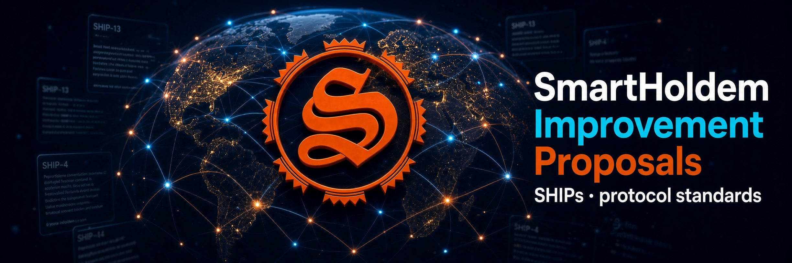

# SHIPs - SmartHoldem Improvement Proposals

SHIPs describe standards for the SmartHoldem network: consensus rules, transaction types, wire formats, node behaviour,
peer-to-peer transport, tooling and processes. A SHIP is a design document providing information to the community and
describing a new feature, its rationale and a reference implementation in `sth-core` (Rust).

- Repository: <https://github.com/smartholdem/SHIPs> · Discussions: <https://github.com/smartholdem/SHIPs/issues>
- Process and template: [SHIP-1](SHIPS/SHIP-1.md).
- PQ Node: SmartHoldem Rust Core Node (`sth-core`) with Post-Quantum Key Commitments and Hybrid Block Signatures: [SHIP-18](SHIPS/SHIP-18.md), [SHIP-20](SHIPS/SHIP-20.md), [SHIP-22](SHIPS/SHIP-22.md).

## Statuses

| Status | Meaning |
|---|---|
| **Active** | Implemented in `sth-core`, rules enforced on mainnet (or enforced as soon as the feature is used). |
| **Accepted** | Implemented and tested in `sth-core`, activation on mainnet waits for a milestone / delegate upgrade. |
| **Draft** | Proposal under discussion; may change or be withdrawn. |
| **Final** | Frozen standard; changes require a new SHIP. |

## Index

|                   SHIP | Title                                                                | Type            | Category   | Status   |
|-----------------------:|----------------------------------------------------------------------|-----------------|------------|----------|
|   [1](SHIPS/SHIP-1.md) | SHIP Purpose and Guidelines                                          | Process         | -          | Active   |
|   [2](SHIPS/SHIP-2.md) | Rust Core Node (`sth-core`)                                          | Standards Track | Core       | Active   |
|   [3](SHIPS/SHIP-3.md) | Compact State Database on Sled                                       | Standards Track | Core       | Active   |
|   [4](SHIPS/SHIP-4.md) | Web4 Peer-to-Peer Layer on Iroh (Gossip + RPC)                       | Standards Track | Networking | Active   |
|   [5](SHIPS/SHIP-5.md) | Dual-Stack Networking: Legacy WebSocket Bridge and Peer Discovery    | Standards Track | Networking | Active   |
|   [6](SHIPS/SHIP-6.md) | Snapshots: Dump Import, Fast Import and Download                     | Standards Track | Core       | Active   |
|   [7](SHIPS/SHIP-7.md) | Parallel Signature Verification and Fast Vote Index                  | Standards Track | Core       | Active   |
|   [8](SHIPS/SHIP-8.md) | Operator Metrics Page and Delegate Dashboard (Version Guard)         | Standards Track | Interface  | Active   |
|   [9](SHIPS/SHIP-9.md) | Isolated Networks from the Command Line (`init newnet`)              | Standards Track | Tooling    | Active   |
| [10](SHIPS/SHIP-10.md) | Standalone Client `sth-cli`                                          | Standards Track | Tooling    | Active   |
| [11](SHIPS/SHIP-11.md) | Transaction Wire Format v2 and Schnorr Signatures                    | Standards Track | Core       | Final    |
| [12](SHIPS/SHIP-12.md) | Multipayment with up to 1 024 Recipients                             | Standards Track | Core       | Draft    |
| [13](SHIPS/SHIP-13.md) | SmartObjects (sObject) - Programmable On-Chain Objects               | Standards Track | Core       | Active   |
| [14](SHIPS/SHIP-14.md) | Native Tokens (typeGroup 3)                                          | Standards Track | Core       | Accepted |
| [15](SHIPS/SHIP-15.md) | Token Manifest (TokenMeta) with On-Chain Logos                       | Standards Track | Core       | Accepted |
| [16](SHIPS/SHIP-16.md) | sObject Transfer and Decentralised Market (sell / buy)               | Standards Track | Core       | Accepted |
| [17](SHIPS/SHIP-17.md) | STH Burn: Fee Burning with Milestone-Controlled Share                | Standards Track | Core       | Accepted |
| [18](SHIPS/SHIP-18.md) | Quantum Shield Stage A - Post-Quantum Key Commitments                | Standards Track | Core       | Active   |
| [19](SHIPS/SHIP-19.md) | Transaction Wire Format v3 - Second-Signature Blocks                 | Standards Track | Core       | Accepted |
| [20](SHIPS/SHIP-20.md) | Quantum Shield Stage B - ML-DSA-44 Second Signature                  | Standards Track | Core       | Accepted |
| [21](SHIPS/SHIP-21.md) | Wallet Quantum Shield - Client Requirements                          | Standards Track | Interface  | Accepted |
| [22](SHIPS/SHIP-22.md) | Quantum Shield Stage C - Hybrid Block Signatures                     | Standards Track | Core       | Accepted |
| [23](SHIPS/SHIP-23.md) | On-Chain Governance: Delegate Proposals with 11-of-21 Quorum         | Standards Track | Core       | Draft    |
| [24](SHIPS/SHIP-24.md) | TokenUpdate - Ownership Transfer and Flag Tightening                 | Standards Track | Core       | Draft    |
| [25](SHIPS/SHIP-25.md) | TokenFreeze - Account Freezing for Regulated Assets                  | Standards Track | Core       | Draft    |
| [26](SHIPS/SHIP-26.md) | Non-Fungible Tokens (subType 1: tokenId + serial)                    | Standards Track | Core       | Draft    |
| [27](SHIPS/SHIP-27.md) | Atomic Swaps STH <> Token via HTLC                                   | Standards Track | Core       | Draft    |
| [28](SHIPS/SHIP-28.md) | Deflationary Tokens - Burn Share on Transfer                         | Standards Track | Core       | Draft    |
| [29](SHIPS/SHIP-29.md) | Confidential Transfers - Shielded Pool with Post-Quantum Proofs      | Standards Track | Core       | Draft    |
| [30](SHIPS/SHIP-30.md) | Chain Compression with Evolutionary (Genetic) Encoding Search        | Standards Track | Core       | Draft    |
| [31](SHIPS/SHIP-31.md) | State and History Pruning                                            | Standards Track | Core       | Draft    |
| [32](SHIPS/SHIP-32.md) | Sharding - Sender-Partitioned Execution Lanes                        | Standards Track | Core       | Draft    |
| [33](SHIPS/SHIP-33.md) | Safe Contracts - Declarative, Non-Turing-Complete sObject Programs   | Standards Track | Core       | Draft    |
| [34](SHIPS/SHIP-34.md) | Dead Crypto - Dead Man's Switch and Digital Legacy                   | Standards Track | Core       | Draft    |
| [35](SHIPS/SHIP-35.md) | BFT Finality Gadget over Iroh Gossip                                 | Standards Track | Core       | Accepted |
| [36](SHIPS/SHIP-36.md) | Compact Blocks and Parallel State Application                        | Standards Track | Core       | Draft    |
| [37](SHIPS/SHIP-37.md) | Netfory Web4 Integration - `ntfryData` and `sth://` Content Links    | Standards Track | Interface  | Draft    |
| [38](SHIPS/SHIP-38.md) | Light Clients - Verifiable State Commitments                         | Standards Track | Core       | Draft    |
| [39](SHIPS/SHIP-39.md) | Sub-Second Slots and Pipelined Forging                               | Standards Track | Core       | Draft    |
| [40](SHIPS/SHIP-40.md) | Post-Quantum E2EE Key Registry and Encrypted On-Chain Memos (ML-KEM) | Standards Track | Core       | Draft    |
| [41](SHIPS/SHIP-41.md) | Dynamic Fees - Per-Node Pool Policy and the Wallet Fee Formula       | Standards Track | Interface  | Active   |

## Categories

- **Core** - consensus, transaction types, state, validation rules.
- **Networking** - peer-to-peer transport, gossip, discovery.
- **Interface** - REST API, wallet and explorer requirements, operator UI.
- **Tooling** - command-line tools, network generation, release process.